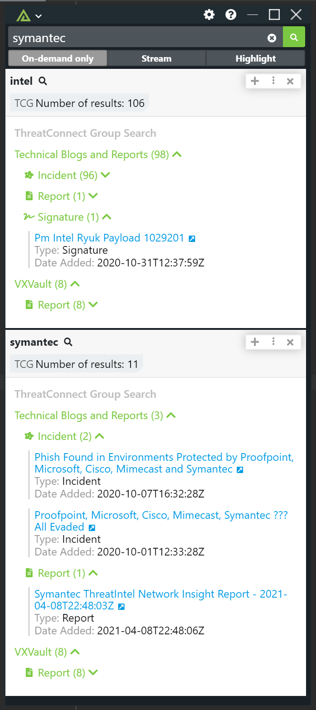

# Polarity ThreatConnect Intel Search Integration

The Polarity ThreatConnect Intel Search integration allows Polarity to search Group titles in your instance of ThreatConnect.  

The integration works by caching up to 10,000 group objects per owner in memory.  The integration will then search the title of these group objects and return any matches. The cached group objects are refreshed automatically every hour.

By default the integration supports full text searches.  Please check the "Manage Integration Data" option to modify what entity types are searched. 

  

## ThreatConnect Integration Options

### ThreatConnect API URL

The API URL of the ThreatConnect instance you would like to connect to (including http:// or https://).  If you are running an internal instance of ThreatConnect on a non-default port, please specify the port here as well.  Note the API URL may end with `/api` in some circumstances. 

### Access ID

Account Identifier that is associated with the API Key

### API Key

The API (secret) Key associated with the provided Access ID

### Group Type Result Limit

For each owner, specify the maximum of number of group objects to return per group type (defaults to 25).

### Max Lookback Days

Maximum of number of days back to search for group objects (defaults to 365).

### Group Types to Return

The types of group objects that should be returned to Polarity. Some of the groups shown are only available in ThreatConnect version 6.3 and after. Please check that you have the groups selected before querying

### Organization Search Allowlist

By default all organizations visible to the provided API User will be searched. This blocklist is a comma delimited list of organizations you do not want searched. This option cannot be used in conjunction with the "Organization Search Allowlist" option.

### Maximum Search Term Length

Search terms over this length will not be searched. Set to 0 for no search limit. If you have the "allText" custom entity type enabled you should set a maximum search term length. (Defaults to 100)

## Installation Instructions

Installation instructions for integrations are provided on the [PolarityIO GitHub Page](https://polarityio.github.io/).

## Polarity

Polarity is a memory-augmentation platform that improves and accelerates analyst decision making.  For more information about the Polarity platform please see:

https://polarity.io/
